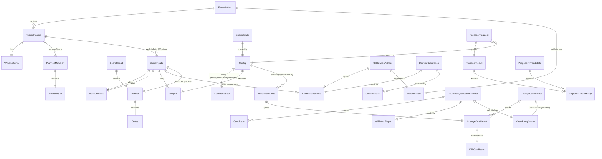

# codenuke — AI-Native Specification

> **Purpose.** This is the *specification source* for a greenfield rebuild of
> codenuke onto **Effect-TS**. The legacy repo is the spec source, **not** the
> structural template. Generated by `/modernize-reimagine` (2026-05-24) by
> synthesizing three parallel mining agents over the existing deep analysis.
>
> **Target vision (verbatim):** *"rewrite entirely using
> [Effect](https://github.com/effect-ts/effect) modern TS, performant, use
> code-sdk, streaming progress, POSIX compliant, agent optimised."*
>
> **Companion artifacts (full detail):**
> - [`spec/BEHAVIOR_CONTRACT.md`](./spec/BEHAVIOR_CONTRACT.md) — 61 Given/When/Then rules (the acceptance tests)
> - [`spec/INTERFACE_CONTRACTS.md`](./spec/INTERFACE_CONTRACTS.md) — inbound/outbound interfaces + contract fragments
> - [`spec/DOMAIN_MODEL.md`](./spec/DOMAIN_MODEL.md) — entities, aggregates, erDiagram
> - Discovery: [`ASSESSMENT.md`](./ASSESSMENT.md), [`ARCHITECTURE.mmd`](./ARCHITECTURE.mmd), [`DATA_OBJECTS.md`](./DATA_OBJECTS.md), [`BUSINESS_RULES.md`](./BUSINESS_RULES.md)

---

## 0. What codenuke is (one paragraph)

codenuke is an autonomous, **behavior-preserving code-reduction CLI**. It applies
Karpathy's autoresearch loop to refactoring: an LLM **proposer** makes one focused
reduction inside an isolated git worktree; an **immutable scorer** decides
keep-or-revert by first applying hard safety gates (tests pass, behavior-fence
admissible, no new type errors, strictly smaller AST) and then a value model
(`loss = risk − gain`; keep iff `loss < 0`). Behavior fidelity is measured by
**AST-aware mutation testing** with **Wilson confidence intervals**. Periodic
artifacts (fence, calibration, value-proxy, change-cost) **fail closed** to gate
long unattended runs. There is **no database** — all state is JSON/fs artifacts.

> **Assessment caveat carried forward:** the discovery phase rated codenuke
> *"already-modern"* and recommended *refactor over rewrite*. The reimagine is
> nonetheless warranted by the explicit target: Effect's typed errors, dependency
> `Layer`s, structured concurrency, and `Stream` give a categorically different
> safety/observability posture than the current Promise/imperative code. This spec
> therefore captures **intent**, and Phase C decides what to keep, fix, or drop.

---

## 1. Capabilities

The system must do the following. Each capability maps to a cluster of behavior
rules and is the unit of the **P0 decision** (Phase B). `[#rules]` = rules behind it.

| # | Capability | What it must do | Rules | Default tier |
|---|------------|-----------------|------:|:---:|
| C1 | **Scoring & Value Model** | Compute `gain`/`risk`/`loss` from weighted, scaled, calibrated axis deltas and emit the immutable `Verdict`. | 8 | **P0 — core** |
| C2 | **Safety Gates** | Enforce G1 (tests pass), G1′ (every touched region fence-admissible), G3 (no new type errors), G4 (ΔAST>0) before any value math; reject on any failure. | 7 | **P0 — core** |
| C3 | **Behavior Fence / Mutation Audit** | AST-aware mutation testing per region, deterministic sampling (cap/seed), Wilson interval, survivor classification, monotonic replay → the fence artifact the loop gates on. | 6 | **P0 — core** |
| C4 | **Loop Orchestration** | Region/mode selection, fail-closed startup gate, propose→score→keep/revert iteration lifecycle (reduce + raise modes), worktree lifecycle. | 6 | **P0 — core** |
| C5 | **Measurement** | AST node count `L`, cyclomatic complexity, duplicate-window mass — the atoms every value calc starts from. | 5 | **P0 — core** |
| C6 | **Worktree & Proposer Substrate** | Isolated git worktree (node_modules invariant, anti-cheat isolation) + proposer subprocess/SDK management (timeout, failure class). | 3 | **P0 — core** |
| C7 | **Config Resolution** | Resolve config from env → `codenuke.loop.json` → auto-detection; source/region classification; reject legacy shell-string commands; numeric/weight bounds. | 5 | **P0 — core** |
| C8 | **Security / Trust-Boundary Guards** | shell:false argv everywhere; path-traversal/symlink guards; git ref/pathspec safety; engine-state validation; permutation DoS cap. | 6 | **P0 — core** |
| C9 | **Calibration** | Derive per-repo value scales (median of positive per-axis commit deltas) from git history; provenance-gated artifact. | 2 | P1 |
| C10 | **Value-Proxy Validation** | Spearman ρ + permutation p-value correlating the cheap inner-loop proxy against ground-truth change cost; corpus/effect-size/significance gates. | 7 | P1 (req. for long runs) |
| C11 | **Change-Cost Ground Truth** | Held-out benchmark: implementer attempts tasks, measure `cost = editTokens + β·verifyFrac` → 𝒱̂. | 5 | P1 |
| C12 | **Results Journal & Status** | `results.tsv` trajectory + cumulative-reduction status display. | 1 | P2 |

**Capability dependency order:** C5 → C1 → C2 → C3 → C4 (the inner loop); C6/C7/C8
are foundation under all of them; C9/C10/C11 are periodic artifacts that *gate*
C4 but are not part of a single iteration; C12 is observability.

> **Phase B note.** A minimal but *honest* codenuke = **C1–C8** (the inner loop +
> foundations). C9–C11 can be deferred if long unattended runs are out of P0 scope,
> but dropping them means the startup gate (RULE-030) and the value-scale quality
> degrade to defaults. C12 is cosmetic. See the question posed in Phase B.

---

## 2. Domain Model

Full entity catalog, kinds, invariants, aggregate roots, and bounded contexts in
[`spec/DOMAIN_MODEL.md`](./spec/DOMAIN_MODEL.md). Summary:

**Aggregates (root entity):** Scoring (`Verdict`) · Fence (`FenceArtifact`) ·
Calibration (`CalibrationArtifact`) · ValueProxy (`ValueProxyValidationArtifact`) ·
ChangeCost (`ChangeCostArtifact`) · LoopState (`EngineState`) · Config (`Config`) ·
ArtifactGate (policy over `ArtifactStatus`).

In Effect these become **`Schema`-defined value objects** (pure, immutable,
self-validating with the invariants below), **persisted artifacts** decoded/encoded
through `Schema` at the fs boundary, and **services** (`Context.Tag` + `Layer`) for
the side-effectful aggregates.

**Key invariants the rebuild must encode in `Schema`:**
- Wilson `p/lo/hi` clamped to `[0,1]`, `lo ≤ p ≤ hi`.
- Calibration scales `sL/sCx/sDup` positive **finite** numbers (else fall back to defaults; never divide by zero).
- `baselineSha` is 40-hex; engine-state SHA must reconcile with the pinned baseline.
- `FenceArtifact.method === "ast-aware"`, `threshold === fenceLB`, else *invalid-metadata* (fail closed).
- `loss = risk − gain`, `null` when non-finite/inadmissible; `keep ⟺ admissible ∧ loss<0`.

---

## 3. Interface Contracts

Full inbound/outbound catalog + TypeScript/JSON-Schema contract fragments in
[`spec/INTERFACE_CONTRACTS.md`](./spec/INTERFACE_CONTRACTS.md). codenuke is a CLI
(no HTTP/DB), so the "interfaces" are commands, env, config, and fs/process/SDK.

### 3.1 Inbound — CLI commands (POSIX target)

| Command | Signature | Purpose | Exit codes (target) |
|---------|-----------|---------|---------------------|
| `fence` | `[cap=60] [seed=1337] [regions]` | mutation-testing audit → `fence-fidelity.json` | 0 ok / 1 error |
| `fence replay` | `<region> [worktree]` | monotonic survivor replay (keep iff strictly-higher lower bound) | 0/1 |
| `run` (alias `loop`) | `[iterations=5]` | the propose→score→keep/revert autoloop | 0/1 |
| `score` | `[--json]` | score the current worktree change | 0/1 |
| `changecost` | `[ref]` | held-out change-cost ground truth (𝒱̂) | 0/1 |
| `validate-proxy` | `[input]` | Spearman proxy↔𝒱̂ validation | 0/1 |
| `calibrate` | — | derive per-repo value scales from git history | 0/1 |
| `doctor` | — | readiness/gap report | **0 ready / 2 not-ready** |
| `init`/`accept`/`revert`/`status`/`cleanup` | — | manual scorer lifecycle | 0/1 |
| `--version`/`-v` | — | version | 0 |

**Config inputs:** env (`CN_*`) → `codenuke.loop.json` → auto-detection. Env groups:
scope/identity, scoring/thresholds, commands (`*_FILE` + `*_ARGS_JSON`),
codex/proposer, injected-outbound (`CN_REGION`/`CN_DELTA`). Legacy shell-string
commands (`CN_TEST`/`CN_TYPECHECK`/`CN_PROPOSER`/`CN_IMPLEMENTER`) **throw** —
preserve this rejection.

### 3.2 Outbound — artifacts & integrations

`.codenuke/{fence-fidelity,calibration,value-proxy-validation,changecost,proposer-threads}.json`
(all `schemaVersion:1`, `Schema`-decoded, fail-closed) · `results.tsv` append log ·
`/tmp` worktree + `.state.json` + `.prompt.txt` · **git** (worktree add/reset/remove,
diff/shortstat, ls-tree/show/status — all argv, shell:false) · **subprocess**
test/typecheck/implementer + codex · **LLM** proposer via the agent **code-SDK**
(`ProposerRequest`/`ProposerResult`; streamed events `command_execution`,
`file_change`, `agent_message`, `turn.completed`/`turn.failed`).

### 3.3 Streaming / progress (the reimagine focal point)

Today: a **synchronous push reporter** — an optional `{emit(line)}` (fence uses a
typed `{emit(RuntimeEvent)}`) threaded through every command and subprocess, with
15s heartbeats; the CLI `liveReporter` streams immediately while reconciling final
stdout to avoid double-printing. **Target:** model this as an **Effect `Stream` of a
typed progress-event ADT** (seed from fence's `RuntimeEvent` union:
audit-start / phase / region-plan / mutation-progress / region-result / artifact /
message), renderable as a human TTY view *and* as **NDJSON for agents**
(`--json`/`--stream` clean stdout, no `@@JSON@@` sentinel).

---

## 4. Non-Functional Requirements

Inferred from the legacy system, plus the explicit target vision.

### 4.1 Inherited (must preserve)
- **Determinism.** Mutation sampling is seeded (`seed=1337`, `cap=60`/region); the
  scorer is a pure function of its inputs. Same inputs ⇒ same `Verdict`. **Hard requirement.**
- **Fail-closed.** Missing/stale/invalid/tampered safety artifacts ⇒ block, never
  proceed on defaults silently (RULE-022/023/024/030).
- **Immutability of the judge.** The scorer must not be editable by the proposer;
  scoring runs from a tree the candidate cannot touch (anti-cheat, RULE-046).
- **User working tree is never edited** by the loop — all edits happen in the
  isolated worktree.
- **Trusted-repo boundary.** All codenuke-owned commands run argv-only,
  `shell: false` (CWE-78 remediation). Untrusted repos require an outer sandbox.
- **No database.** State is JSON/fs artifacts only.

### 4.2 Budgets / volumes / windows
- Proposer turn: **timeout 900000 ms (15 min)** default, **budget $8** default.
- Long-run threshold: **5 iterations** (`LONG_RUN_ITERATIONS`) flips on the
  value-proxy requirement.
- Mutation audit cost ≈ `cap × regions` test runs — the dominant runtime cost;
  this is the **primary parallelization target** in the rebuild.
- Value-proxy gates: `minimumCandidates=6`, `minimumRho=0.6`, `alpha=0.05`,
  permutation `exactCap=362880` (9!) then `samples=50000`.
- Scale defaults: `scaleL=150, scaleCx=15, scaleDup=5`; weights `dL=1.0, dCx=1.8,
  dDup=0.35, r3=1.0`; `fenceLB=0.90`; `β=60`.

### 4.3 Target (new, from the vision)
- **Effect-TS throughout.** `Effect<A,E,R>` with **tagged errors** replacing
  thrown exceptions and `null`-loss sentinels; **`Layer`** dependency injection
  replacing implicit module wiring; **`Schema`** for every artifact + config +
  CLI-arg boundary; **`Stream`** for progress.
- **Performant.** Replace the sequential mutation loop with **structured
  concurrency** (`Effect.forEach(..., { concurrency })`) across regions/mutants,
  bounded by a config knob; respect the *configured* timeouts (fix the hardcoded
  45s/300s overrides — `[LEGACY-DEFECT]`).
- **POSIX compliant.** Correct exit codes (notably `doctor` → 0/2), strict
  stdout(data)/stderr(diagnostics) separation, clean `--json` machine output,
  `SIGINT`/`SIGTERM` → graceful worktree cleanup (Effect scoped finalizers),
  honor `NO_COLOR`/non-TTY.
- **Agent-optimised.** First-class `--json`/NDJSON event stream, structured
  tagged errors (machine-parseable), idempotent/resumable commands, deterministic
  ordering, exit codes that an agent can branch on.
- **code-SDK proposer.** The proposer is an injected `Layer` over the agent
  **code-SDK** (streamed turns, thread continuity, usage/cost) — swappable for
  test doubles so the loop is testable without a live model.

---

## 5. Behavior Contract (acceptance tests)

The **61 Given/When/Then rules** in
[`spec/BEHAVIOR_CONTRACT.md`](./spec/BEHAVIOR_CONTRACT.md) are the acceptance
criteria. Each rule has a fixed parseable block
(`RULE-### / GIVEN / WHEN / THEN / SOURCE / ACCEPTANCE`) and carries
`[capability][priority][type]`. Phase E scaffolds one executable acceptance test
per rule (skip/xfail with the rule ID until implemented).

Priority split: **P0 = 31, P1 = 25, P2 = 5.** (RULE-036/037 retired by the source's
own numbering — not missing.)

### 5.1 Legacy defects — DO NOT port faithfully

The rebuild should **fix**, not replicate, these. Flagged `[LEGACY-DEFECT]` in the
contract:

| Rule | Defect | Fix in rebuild |
|------|--------|----------------|
| **RULE-054** | `changeCostArtifactStatus` is implemented + tested but has **zero production callers** — `changecost.json` is the one safety artifact never re-validated at startup (the fail-closed gating gap). | Wire into the startup gate (C2/C4). |
| **RULE-063** | `verdictLabel` reports only the highest-priority failing gate, **masking** concurrent G1/G3/G4 failures in the journal. | Emit *all* failing gate names. |
| **RULE-053** | Scorer reads `.state.json` **unvalidated** while the orchestrator validates the identical shape (CWE-502). | One shared validating (`Schema`-decoded) reader. |
| **RULE-050** | Two divergent `safeWorktreePath` impls + two worktree reads bypass the guard via raw string concat (CWE-22/59). | One guard; route every read through it. |
| **RULE-002 / 013 / 054** *(cross-cutting)* | Fence-gap aggregated as **min** for scorer risk but **mean** for change cost, the mean re-implemented in 3 places with divergent null/empty ordering. | One shared helper; decide min-vs-mean explicitly. |

Lower-blast-radius suspected defects are inlined on their rules (underived weights,
duplicated β=60/budget literals, `iter` mislabel, `raise-skip` aborting the whole
run, no proposer cooldown/thread-expiry, silent relink failure, TSV injection,
`isSourceFile` duplicated 4×).

---

## 6. Phase-B decision record

_Recorded at HITL checkpoint #1 (2026-05-24)._

- **P0 capabilities:** **C1–C11** — the full inner loop + foundations
  (C1 Scoring, C2 Safety Gates, C3 Behavior Fence, C4 Loop Orchestration,
  C5 Measurement, C6 Worktree & Proposer Substrate, C7 Config, C8 Security)
  **plus the periodic safety gates** (C9 Calibration, C10 Value-Proxy
  Validation, C11 Change-Cost Ground Truth). **60 / 61 rules in scope.**
- **Deliberately dropped (for now):** **C12 Results Journal & Status** —
  `results.tsv` + cumulative-reduction status display (RULE-041, RULE-062).
  Cosmetic/observability; the typed progress `Stream` (§3.3) covers live
  feedback, and a journal sink can be added later as a `Stream` consumer.
  RULE-063 (verdict-label) is still **in scope** as a *fix* even though the
  journal that surfaces it is deferred — the corrected multi-gate verdict is
  part of C2.
- **Defect policy:** **Fix the 5 flagged defects in the rebuild.** Acceptance
  tests assert the *corrected* behavior; where a legacy characterization test
  encodes the old behavior, the rebuild records a documented divergence note
  instead of replicating the bug:
  - RULE-054 → wire `changecost.json` re-validation into the startup gate.
  - RULE-063 → verdict emits **all** failing gate names (G1/G1′/G3/G4).
  - RULE-053 → one shared `Schema`-validated engine-state reader.
  - RULE-050 → one path-traversal/symlink guard; every worktree read routes through it.
  - RULE-002/013/054 → one shared fence-gap helper; min-vs-mean chosen explicitly
    (min for scorer risk, mean for change cost — made an intentional, documented choice).
- **Rationale:** Preserving C9–C11 keeps the fail-closed posture that makes long
  unattended runs trustworthy (the whole point of the value model); only the
  cosmetic journal is deferred. Fixing the defects is low-cost in a greenfield
  build and avoids shipping known bugs into the new system — Effect's typed
  errors + `Schema` decoding make the fixes (especially RULE-053/050) fall out
  naturally rather than being bolt-ons.
