# codenuke — Reimagined Architecture (Effect-TS)

> Target architecture for the greenfield rebuild. Spec source:
> [`AI_NATIVE_SPEC.md`](./AI_NATIVE_SPEC.md). Scope locked at Phase B:
> **P0 = C1–C11** (drop C12), **fix the 5 legacy defects**.
> Stack: **[Effect](https://github.com/effect-ts/effect)** (effect 3.x),
> `@effect/cli`, `@effect/platform` + `@effect/platform-node`, `effect/Schema`.
>
> _Status: incorporates the architecture-critic review (see §11)._

---

## 1. Design principles

1. **The legacy is the spec, not the shape.** Keep the *contract* (61 rules,
   artifact formats, CLI surface); discard the imperative Promise/try-catch
   structure.
2. **A pure functional kernel, an effectful shell.** All decision logic
   (scoring, gates, Wilson, Spearman, value math) is **pure** — `(input) ⇒
   output`, no `Effect`, no IO. Everything side-effectful (git, fs, subprocess,
   SDK, clock, randomness-seed) is an **Effect service** behind a `Layer`.
   The judge stays immutable and trivially testable.
3. **Errors are values.** Every failure mode is a `Data.TaggedError`; no thrown
   exceptions, no `null`-as-error (kills the legacy `loss: number|null` and
   unvalidated reads). Exit codes are derived from the error tag.
4. **Boundaries are typed.** `effect/Schema` decodes/encodes **every** crossing:
   CLI args, env, `codenuke.loop.json`, all `.codenuke/*.json` artifacts, the
   engine state, and the proposer SDK payloads. Invalid in ⇒ tagged error ⇒
   fail closed.
5. **Progress is a stream.** One typed `Stream` of progress events; the TTY
   renderer and the NDJSON agent renderer are two consumers of the same stream.
6. **Determinism is load-bearing.** Seeds (`seed=1337`), `cap`, weights, and the
   pure kernel guarantee identical `Verdict`s for identical inputs — preserved
   and now *enforced* by property tests.

---

## 2. C4 Container diagram

```mermaid
C4Container
    title Container diagram — codenuke-reimagined

    Person(user, "Agent / Engineer", "Runs codenuke on a trusted JS/TS repo")

    System_Boundary(cn, "codenuke-reimagined (single CLI binary)") {
        Container(cli, "CLI Shell", "@effect/cli, @effect/platform-node", "Parses argv & env, POSIX exit codes, SIGINT cleanup, picks renderer (TTY | NDJSON)")
        Container(progress, "Progress Stream", "effect/Stream", "Typed ProgressEvent ADT; fan-out to human + agent renderers")
        Container(orch, "Orchestrator", "Effect", "Startup gate, region/mode select, propose→score→keep/revert loop, raise loop")
        Container(scoring, "Scoring Kernel", "pure TS + effect/Schema", "decide(): gates G1–G4 then loss=risk−gain; emits Verdict")
        Container(fence, "Fence Engine", "Effect (structured concurrency)", "AST-aware mutation audit, Wilson interval, survivor classify, monotonic replay")
        Container(measure, "Measure", "Effect over TS compiler API", "AST node count L, complexity, dup-window mass")
        Container(periodic, "Periodic Artifacts", "Effect", "Calibration, Value-Proxy validation, Change-Cost ground truth")
        Container(artifacts, "Artifact Gate", "effect/Schema", "Decode/validate/anti-tamper all .codenuke/*.json; fail-closed status (fixes RULE-054)")
        Container(config, "Config", "effect/Schema", "env → loop.json → autodetect; rejects shell strings; bounds-checks")
        Container(git, "Git Service", "@effect/platform Command", "Worktree lifecycle, diff/shortstat; single path-guard (fixes RULE-050)")
        Container(proposer, "Proposer Port", "Effect Layer", "Streamed agent turns; swappable adapters; thread continuity")
        ContainerDb(store, "FS State", "JSON + tsv + /tmp", ".codenuke/*.json, engine .state.json, worktrees — no database")
    }

    System_Ext(gitbin, "git", "VCS, worktrees")
    System_Ext(sdk, "Agent code-SDK", "@openai/codex-sdk | claude code-sdk | fake")
    System_Ext(tools, "Repo toolchain", "test runner, tsc (argv, shell:false)")

    Rel(user, cli, "invokes (run/score/fence/doctor/…)")
    Rel(cli, progress, "selects renderer for")
    Rel(cli, orch, "dispatches")
    Rel(orch, scoring, "scores candidate via")
    Rel(orch, fence, "gates on")
    Rel(orch, periodic, "startup-gates on")
    Rel(orch, proposer, "requests reduction")
    Rel(orch, git, "isolates worktree via")
    Rel(scoring, measure, "consumes Measurement")
    Rel(fence, measure, "uses")
    Rel(orch, artifacts, "validates safety artifacts via")
    Rel(periodic, artifacts, "writes/reads")
    Rel(artifacts, store, "decode/encode")
    Rel(config, store, "reads loop.json")
    Rel(git, gitbin, "argv, shell:false")
    Rel(proposer, sdk, "streamed turn")
    Rel(orch, tools, "runs test/typecheck (argv)")
    Rel(orch, progress, "emits ProgressEvent")
```



---

## 3. Package / module topology

Single pnpm workspace, single published CLI binary (parity with legacy
`apps/cli` → `dist/cli.cjs`). **Revised after critique:** the bounded contexts are
**directory modules**, but the *workspace-package* boundary is just **3 packages**
(the §12 scaffold bundles). Fourteen `package.json`s for a ~13 KSLOC single-binary
CLI is ceremony — separate *files* give separate testability without 14 build
targets and a cross-package dependency story to police.

```
modernized/codenuke-reimagined/
├── apps/cli/                       # @effect/cli entrypoint; Layer wiring; tag→exit-code map; runMain/signals
└── packages/
    ├── core/                       # PACKAGE @codenuke/core
    │   └── src/
    │       ├── domain/             # effect/Schema entities + tagged-error ADT (shapes only)
    │       ├── kernel/             # PURE helpers: value math + the one fence-gap helper (min vs mean)
    │       ├── scoring/            # PURE decide(): gates G1–G4 + loss=risk−gain   [C1,C2]
    │       ├── measure/            # AST size/complexity/dup via TS compiler API   [C5]
    │       └── artifacts/          # Schema decode + recompute-and-compare anti-tamper + fail-closed status
    ├── fence/                      # PACKAGE @codenuke/fence
    │   └── src/                    # mutation audit + Wilson + survivor + replay   [C3]
    └── runtime/                    # PACKAGE @codenuke/runtime
        └── src/
            ├── config/             # env→file→autodetect, Schema-validated, rejects shell strings [C7]
            ├── git/                # worktree lifecycle + diff; ONE path-guard; env allowlist [C6,C8]
            ├── proposer/           # code-SDK port + ONE live adapter + FakeProposer  [C6]
            ├── progress/           # ProgressEvent ADT + Queue-backed bus + renderers
            ├── orchestrator/       # the loop, startup gate, region/mode select, doctor [C4]
            └── periodic/           # calibrate [C9] · value-proxy [C10] · changecost [C11]
```

**Dependency direction (acyclic):** `core/domain` ← everything. `core/{kernel,scoring,
measure}` are pure (no `Effect`, no `R`). `fence` and `runtime/periodic` ←
`core` + `runtime/{git}`. `runtime/orchestrator` ← all of the above +
`proposer` + `progress`. `apps/cli` ← `runtime` + `core`.

> The 14 bounded contexts of §4 still exist — as the directory modules above. The
> table maps rules to *modules*; the build maps modules to *3 packages*.

---

## 4. Service boundaries & rationale (which rules/entities live where)

| Service (Layer) | Owns entities | Owns rules | Why this boundary |
|---|---|---|---|
| **domain** | every `Schema` value object + the tagged-error ADT | invariants of all | One source of truth for shapes + invariants; importable by pure and effectful code alike. |
| **scoring** (pure) | `ScoreInputs`,`Gates`,`Verdict`,`Weights`,`CalibrationScales` | RULE-001,002,018–021,035,059,060,061,063 | The judge. Pure ⇒ immutable ⇒ can't be tampered by the proposer (RULE-046 enforced structurally). RULE-063 fix: `Verdict.failedGates: readonly GateName[]`. |
| **measure** | `Measurement` | RULE-003,004,005 | Isolates the TS-compiler-API dependency; the only thing that parses source. |
| **fence** | `MutationSite`,`PlannedMutation`,`RegionRecord`,`WilsonInterval`,`FenceArtifact` | RULE-006,007,008,009,043,051 | The dominant runtime cost; gets its own structured-concurrency budget (§7). Pure mutation/stat core + effectful test-runner shell. |
| **artifacts** | `ArtifactStatus`,`ValueProxyStatus` | RULE-022,023,024,030,054 | Central fail-closed gate. **RULE-054 fix lives here**: one `validateAll` the startup gate calls, including changecost. Anti-tamper = re-decode + recompute via `Schema`. |
| **config** | `Config`,`CommandSpec` | RULE-026,033,034,048,049 | Resolution precedence + bounds in one place; `Schema` rejects shell strings (RULE-048) and out-of-bounds numerics (RULE-049). |
| **git** | (paths/refs) | RULE-045,050,052,061 | All VCS IO via `@effect/platform` `Command` (argv, shell:false). **RULE-050 fix**: one `safeWorktreePath` guard every read routes through. **C8 hardening**: subprocess `env` is an explicit allowlist (CWE-200), not full `process.env`; temp dirs via `mkdtemp` mode `0700`/files `0600`+`O_EXCL` (CWE-377). |
| **proposer** | `ProposerRequest`,`ProposerResult`,`ProposerThread*` | RULE-039(part),042,047,057,058 | Port/adapter so the SDK is swappable and the loop is testable without a model. **One** live adapter + `FakeProposer` (see §5). |
| **progress** | `ProgressEvent` (new) | RULE-047(heartbeat) | The streaming spine; a `Queue`-backed bus decouples producers from the single active renderer (TTY xor NDJSON). |
| **orchestrator** | `EngineState`/`ScorerState` (unified), `ScoreResult` | RULE-025,030,031,032,035(wiring),038,039,040,044,046,053 | The conductor. **RULE-053 fix**: the *single* `Schema`-validated state reader lives here and is shared with scoring; staleness (SHA mismatch) ⇒ `StateStale` tagged error ⇒ exit 1 (parity, *not* silent re-init). **RULE-032**: `doctor` collects **every** gap (no short-circuit), distinct from the startup gate (RULE-030) which stops at the first. |
| **calibrate** | `CommitDelta`,`DerivedCalibration`,`CalibrationArtifact` | RULE-010,023 | Periodic; reads git history. |
| **value-proxy** | `Candidate`,`ValidationReport`,`ValueProxyValidationArtifact` | RULE-011(consumes),014,015,024,027,028,029,056 | Periodic; pure stats core + artifact IO. RULE-056 DoS cap preserved. **Its PRNG and fence's `mulberry32` are intentionally distinct — DO NOT unify (RULE-008 vs 015); unifying silently changes the seeded sample set.** |
| **changecost** | `EditCostResult`,`BenchmarkDelta`,`ChangeCostResult`,`ChangeCostArtifact` | RULE-011,012,013,052,055 | Periodic ground truth; produces 𝒱̂ that value-proxy correlates. **Shared fence-gap helper** (RULE-002/013/054 fix) lives in `core/kernel` (a pure leaf) — used by both `scoring` (min, for risk) and `changecost` (mean, for cost); the min-vs-mean split is an **intentional, documented** choice, not drift. |

**Tagged-error model (the `E` channel), examples:**
`GateFailed`, `ArtifactMissing`, `ArtifactStale`, `ArtifactTampered`,
`ArtifactInvalid`, `ConfigInvalid`, `ShellStringRejected`, `PathEscape`,
`GitFailed`, `ProposerTimeout`, `ProposerBudgetExceeded`, `WorktreeDirty`,
`ReplayPreconditionFailed`, `CorpusTooSmall`, `RankCorrelationUndefined`.
The CLI maps tags → POSIX exit codes (§8).

---

## 5. The proposer port ("use code-sdk")

```ts
// packages/proposer
export class Proposer extends Context.Tag("Proposer")<
  Proposer,
  { readonly propose: (req: ProposerRequest) => Stream.Stream<ProposerEvent, ProposerError> }
>() {}
```

**Revised after critique — ship ONE live adapter, not two:**
- `CodexProposerLive` — adapter over `@openai/codex-sdk` (the **one** live
  adapter; legacy parity, the current sole runtime dep, and what the streamed
  event mapping is modeled on). Selected by `CN_CODEX_PROVIDER`.
- `FakeProposerLive` — deterministic double that applies a scripted patch;
  makes the whole loop runnable in acceptance tests with **no live model**.

A second live adapter (e.g. a Claude code-SDK `ClaudeCodeProposerLive`) is a
later **drop-in** behind the unchanged `Proposer` tag — *documented, not built*,
until there is a real second consumer. The port satisfies the "use code-sdk"
vision without maintaining two streamed-event mappings before either is proven.

The streamed SDK events (`command_execution`, `file_change`, `agent_message`,
`turn.completed/failed`, usage/cost) become `ProgressEvent`s, so proposer
activity shows up live in the active renderer. Thread continuity (`threadId` per
`mode:regionTarget`, RULE-057) is persisted via `artifacts`.

---

## 6. Streaming progress (the reimagine focal point)

```ts
type ProgressEvent =
  | { _tag: "RunStarted"; iterations: number; baselineSha: string }
  | { _tag: "RegionSelected"; region: string; mode: "reduce" | "raise" }
  | { _tag: "ProposerEvent"; ev: ProposerEvent }          // from §5
  | { _tag: "MutationProgress"; region: string; done: number; total: number }
  | { _tag: "Scored"; verdict: Verdict }
  | { _tag: "KeptOrReverted"; kept: boolean; reason: string }
  | { _tag: "ArtifactWritten"; path: string; kind: string }
  | { _tag: "Heartbeat"; ms: number }
  | { _tag: "Message"; level: "info" | "warn" | "error"; text: string }
```

Seeded from fence's existing `RuntimeEvent` union. **Revised after critique:**
produced via an injected `ProgressBus` service backed by a **bounded `Queue`** (not
`PubSub`) — the CLI selects **exactly one** renderer per invocation (TTY *xor*
`--json`), so there is no concurrent multi-subscriber case to justify a `PubSub`.
(`PubSub` is reserved for if/when a deferred C12 journal sink must consume
concurrently with a live renderer.)
- **TTY renderer** — human-readable, color-aware (`NO_COLOR`/non-TTY honored),
  in-place mutation-progress bar.
- **NDJSON renderer** (`--json` / `--stream`) — one JSON object per line on
  **stdout**, diagnostics on **stderr**. Replaces the legacy `@@JSON@@` sentinel.

`Scored` carries the **full `Verdict` including `failedGates`** — that is the
sole observable sink for the **RULE-063 fix** now that C12's `results.tsv` is
deferred, so the RULE-063 acceptance test asserts `failedGates` on the `Scored`
NDJSON event (and `score --json` gains `failedGates`/`blocked` fields).

Heartbeats (15s, RULE-047) become a `Stream` tick merged into the bus.

---

## 7. Concurrency & performance

**Revised after critique (this was the highest-risk section).** The legacy fence
runs all mutants for a region inside a **single** `-fence` worktree, mutating
source **in place** (write → run test → restore) — `cap × regions` *test runs*,
not `cap × regions` *worktrees*. The rebuild keeps that model:

- **Parallelism granularity = per region, never per mutant.**
  `Effect.forEach(regions, auditRegion, { concurrency: cfg.fenceConcurrency })`,
  where each region gets **one isolated worktree** from a bounded pool sized to
  `fenceConcurrency`. **Within** a region, mutants run **sequentially** (in-place
  write/test/restore) — concurrent writers to one tree would corrupt source and
  destroy determinism. Default `fenceConcurrency` from CPU count, capped by config.
  This bounds worktree creation to ≈`min(regions, fenceConcurrency)`, not
  `cap × regions` — avoiding the inode/process storm.
- **Anti-cheat isolation preserved (RULE-046):** one tree per region with
  `node_modules` linked per RULE-045; no shared mutable tree across fibers.
- **Determinism is enforced, not assumed:** a property test runs the audit at
  `concurrency=1` and `concurrency=N` and asserts a **byte-identical
  `FenceArtifact`**. Concurrency reorders *regions*, never the seeded per-region
  sample set or the pure reductions.
- **Respect configured timeouts — three distinct knobs.** Config gains
  `proposerTimeoutMs` (900000, the proposer turn), `testTimeoutMs` (was a
  hardcoded 300s), and `fenceTimeoutMs` (the was-hardcoded 45s per-mutant test),
  each `Schema`-bounded and threaded to the right command — replacing the
  conflated hardcoded overrides (`[LEGACY-DEFECT]`). Timeout ⇒ a specific tagged
  error (`ProposerTimeout` / `CommandTimeout`).
- **Scoped resources.** Worktrees, temp files, and child processes are acquired
  with `Effect.acquireRelease`. Cleanup-on-interrupt is load-bearing on **using
  `runMain` (from `@effect/platform-node`) and never calling `process.exit`** —
  `runMain` wires `SIGINT`/`SIGTERM` to interrupt the main fiber, which runs the
  finalizers ⇒ no orphaned worktrees. (Legacy sets `process.exitCode` and never
  hard-exits, so this is parity, now guaranteed structurally.)

---

## 8. POSIX & agent-optimised surface

- **Exit codes** mapped from error tags **by a tag→code table the `apps/cli`
  `runMain` error handler owns** (this is *not* free from `@effect/cli`, which
  only gives parsing/help/completions): `0` success; `doctor` → `0` ready / `2`
  not-ready (parity); `1` generic failure; distinct codes for `ConfigInvalid`,
  `GateFailed`, `ArtifactMissing/Stale/Tampered` so agents branch on them.
- **`doctor` collects every gap** (RULE-032), unlike the startup gate (RULE-030)
  which fails closed at the first — both read `artifacts.validateAll`, but doctor
  renders the complete list and must not short-circuit.
- **Streams:** data → stdout, diagnostics/progress(TTY) → stderr; `--json` makes
  stdout pure NDJSON. No interleaving.
- **Signals:** graceful cancellation + worktree cleanup via scoped finalizers.
- **Env/flags:** `@effect/cli` gives `--help`/`--version`, typed options, and
  shell completions for free; `NO_COLOR`, non-TTY auto-detected.
- **Idempotent/resumable:** `init`/`status`/`cleanup` and thread continuity make
  re-invocation safe — agent-friendly.

---

## 9. Data migration from legacy stores

codenuke has **no database**; "stores" are fs artifacts. Migration is therefore
schema-compatibility, not ETL:

| Legacy store | Strategy |
|---|---|
| `.codenuke/{fence-fidelity,calibration,value-proxy-validation,changecost,proposer-threads}.json` | Ship `effect/Schema` for `schemaVersion:1` (the current version). The rebuild **reads existing artifacts unchanged** — zero regeneration. Only if a field changes do we bump to `2` with a `Schema.transformOrFail` v1→v2 upgrader. |
| `/tmp/codenuke-<tag>-<region>.state.json` (`EngineState`) | **Ephemeral per-run state — not a carry-over artifact.** Resolves the critique's conflict: we **harden** the temp location (`mkdtemp` `0700`, CWE-377) rather than preserve the predictable legacy path. State is regenerated by `init`; no read-compat needed. Read through the single `Schema`-validated reader (RULE-053 fix); SHA mismatch ⇒ `StateStale` ⇒ **exit 1** (RULE-053 parity), *not* silent re-init. |
| `results.tsv` | C12 deferred. When reintroduced, append to the existing file (legacy rows are read-compatible). |
| `codenuke.loop.json` (config, not state) | Decoded by new `config` `Schema`; **must accept every legacy key** (§4) and reject the 4 legacy shell-string commands with a migration error (RULE-048 parity). |

**Net migration win:** a repo with legacy **`.codenuke/` artifacts** (fence,
calibration, value-proxy, changecost, proposer-threads — all `schemaVersion:1`)
can be driven by the reimagined CLI **without recomputing** the expensive ones.
This holds because those artifacts are validated by **recompute-and-compare**
(within `1e-9`), not version-gated — a contract test pins a legacy artifact and
asserts the rebuild accepts it. The ephemeral `/tmp` state is *not* part of this
carry-over (it is hardened and regenerated).

---

## 10. Technology choices (one-line justification each)

| Choice | Why |
|---|---|
| **effect 3.x** (`effect`) | Typed errors + `Layer` DI + `Schema` + `Stream` in one coherent core; replaces ad-hoc try/catch, null-sentinels, and manual wiring. |
| **`@effect/cli`** | Declarative commands/args/options, `--help`/`--version`/completions, typed parsing → the POSIX surface for free. |
| **`@effect/platform` + `-node`** | `Command.make(file, ...args)` runs subprocesses **argv-only, no shell** by default — the trust boundary (CWE-78) is the *default*, not a discipline (verify against the pinned platform version in the lockfile); `FileSystem` for artifact IO; **`runMain`** for signal→interrupt→finalizer cleanup. |
| **`effect/Schema`** | One decode/encode for every boundary (CLI, env, config, artifacts, SDK); invariants enforced at the edge. The anti-tamper check is **recompute-and-compare** logic run *inside* a `Schema.filter` — `Schema` validates shape, our refinement re-derives Wilson/Spearman/changecost within `1e-9`. |
| **`effect/Stream` + `Queue`** | The progress spine: producers push `ProgressEvent`s to a bounded `Queue`, the one active renderer drains it. (`PubSub` only if a future concurrent sink appears.) |
| **TypeScript compiler API** | Keep — it's the measurement substrate (AST node count/complexity); wrapped as the `measure` Effect service. |
| **Vitest + `@effect/vitest`** | Effect-aware test runner; `@effect/vitest` runs `Effect`/`Layer` tests; `fast-check` (via Schema) for determinism property tests. |
| **pnpm workspace + esbuild bundle** | Parity with legacy packaging (`dist/cli.cjs`); keeps the published `codenuke` bin single-file. |
| **Proposer port + adapters** | "use code-sdk" without lock-in; `FakeProposer` makes the loop testable offline. |
| **oxlint/oxfmt** | Keep the legacy toolchain; no churn. |

---

## 11. Architecture-critic review — incorporated

The architecture-critic agent reviewed the draft adversarially. All findings were
incorporated:

**Blockers (fixed):**
- **Per-mutant worktree clones** → §7 rewritten to **one worktree per region**
  (bounded pool), in-place sequential mutation, parallelism across regions only.
  Avoids the inode/process storm and the determinism/anti-cheat hazard.
- **Intra-region concurrency corrupting in-place mutation** → mutants sequential
  within a region tree; determinism enforced by a concurrency=1-vs-N byte-identity
  property test.

**Majors (fixed):**
- **RULE-032 doctor** ("collect every gap", no short-circuit) → assigned to
  `orchestrator` (§4, §8).
- **C8 security hardening** silently dropped → added env allowlist (CWE-200) +
  `mkdtemp 0700`/`0600`+`O_EXCL` temp files (CWE-377) to the `git` service (§4).
  (CWE-117 TSV injection rides with the deferred C12 — acceptable.)
- **§9 migration self-conflict** (`/tmp` read-unchanged vs hardening) → resolved:
  `/tmp` state is ephemeral & hardened, **not** a carry-over; only `.codenuke/*.json`
  carries over. Staleness wording fixed to RULE-053 (exit 1, not silent re-init).
- **14 packages over-decomposition** → collapsed to **3 workspace packages**
  (`core`/`fence`/`runtime`); the 14 contexts are directory modules (§3).
- **Proposer trio speculative** → **one** live adapter (`Codex`) + `Fake`; second
  adapter documented as a drop-in, not built (§5).
- **`Hub` fan-out heavier than needed** → bounded `Queue` + single renderer (§6, §10).
- **Effect API mis-claims** → `PubSub` (not `Hub`); exit-code table owned by
  `runMain` handler (not "free" from `@effect/cli`); finalizers require `runMain` +
  no `process.exit` (§7, §8, §10).
- **C12 vs RULE-063** → `failedGates` surfaced on the `Scored` NDJSON event +
  `score --json`; acceptance test asserts there (§6).

**Minors (fixed):** fence-gap helper moved to `core/kernel` (pure leaf), not
`domain` (§4); explicit "two PRNGs, do not unify" note (§4); three distinct
timeout knobs `proposer`/`test`/`fence` (§7); anti-tamper reworded to
"recompute-and-compare" (§9, §10).

**Critic's "keep as-is" (validated, unchanged):** pure-kernel/effectful-shell
split; errors-as-values → exit-code map; `Schema` at every boundary;
`FakeProposer`; wiring RULE-054 into `artifacts.validateAll`; reading legacy
`schemaVersion:1` artifacts unchanged; seeding `ProgressEvent` from fence's
`RuntimeEvent`.

---

## 12. Scaffolding plan (Phase E)

The reimagine run scaffolds the **3 workspace packages** (which *are* the §3
package boundary — the scaffold bundles and the build units are now the same thing):

1. **`@codenuke/core`** = `domain` + `kernel` + `scoring` + `measure` + `artifacts`
   — the pure kernel + the fail-closed gate. Most rules, fully unit-testable,
   carries the RULE-054/053/063 fixes. **Scaffold first** (everything depends on it).
2. **`@codenuke/fence`** — the standout Effect concurrency slice (mutation audit,
   Wilson, replay) with the per-region-worktree model + determinism property test.
3. **`@codenuke/runtime`** = `config` + `git` + `proposer` + `progress` +
   `orchestrator` + `periodic` + `apps/cli` — the wiring, streaming, POSIX/agent
   surface, security guards. `periodic/` (C9 calibrate, C10 value-proxy, C11
   changecost) ships **module stubs with `skip`ped acceptance tests** keyed by
   rule ID in this wave, fleshed out in wave 2 — so the traceability map stays
   complete and nothing P0 silently disappears.

This means **no capability is dropped from the package layout** — C9–C11 live in
`runtime/periodic` from the start as stubs, rather than being a separate deferred
4th/5th/6th package. The cap of 3 is honored because the build units are 3.
