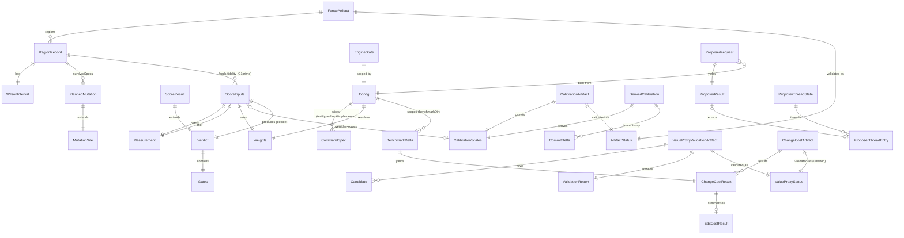

# codenuke — Domain Model

> Consolidation of [`DATA_OBJECTS.md`](../DATA_OBJECTS.md) into a clean domain
> model to anchor the Effect-TS rewrite. Each entity below maps to an Effect
> `Schema` (value objects / persisted artifacts) or an Effect `Service` /
> `Ref` (runtime state). Invariants become `Schema` refinements + tagged errors.
> File:line refs cite the legacy `src/main` declarations.

codenuke has **no database**. Persistence is JSON artifacts under `.codenuke/`,
a `results.tsv` append log, and `/tmp` worktree/state/prompt files. Entity kinds:
**VALUE OBJECT** (pure, immutable, computed in-memory), **PERSISTED ARTIFACT**
(serialized to a concrete on-disk path), **RUNTIME STATE** (mutable orchestration
context, possibly checkpointed).

---

## 1. Entity List

### Measurement & scoring

| Entity | Kind | Persistence | Responsibility | Key invariants |
|--------|------|-------------|----------------|----------------|
| **Measurement** `measure.ts:13` | VALUE OBJECT | — (in-memory snapshot) | Size/complexity/duplication snapshot of a region's source — the atom every value calc starts from | `L`, `complexity`, `dupMass` are finite ≥ 0 |
| **Weights** `scorer.ts:31` | VALUE OBJECT | — (resolved from Config) | Scoring trade-off vector (axis weights + default scales + fence-gap risk weight) | All fields finite; scales (`scaleL/Cx/Dup`) > 0; resolved from Config/env overrides |
| **CalibrationScales** `scorer.ts:41` | VALUE OBJECT | — (carried in Calibration artifact) | Per-repo axis normalizers overriding weight-default scales | `sL`, `sCx`, `sDup` positive & finite (else fall back to defaults) |
| **ScoreInputs** `scorer.ts:48` | VALUE OBJECT | — (assembled by orchestrator) | Everything pure `decide` needs, resolved by the side-effectful caller | `before`/`after` are valid Measurements; `touchedFidelities` ∈ [0,1]; `[]` ⇒ mfence=1 |
| **Gates** `scorer.ts:68` | VALUE OBJECT | — (nested in Verdict) | The four boolean safety gates (G1 tests · G1′ fence · G3 type-errors · G4 ΔAST) | Pure booleans; `admissible = G1 ∧ G1′ ∧ G3 ∧ G4` |
| **Verdict** `scorer.ts:75` | VALUE OBJECT | — (logged to results.tsv) | The immutable keep/revert decision — the single most important output | `keep ⇒ admissible ∧ loss<0`; `loss=null` when non-finite/inadmissible; `mfence`∈[0,1] |
| **ScoreResult** `runtime.ts:83` | VALUE OBJECT | — (Verdict + run context) | Verdict extended with `files`/`touched`/`blocked: string[]` for reporting | Superset of Verdict invariants |

### Fence (behavior fidelity)

| Entity | Kind | Persistence | Responsibility | Key invariants |
|--------|------|-------------|----------------|----------------|
| **MutationSite** `fence.ts:28` | VALUE OBJECT | — | A single injectable behavior change (operator flip) | `0 ≤ start < end`; `repl`/`op` non-empty |
| **PlannedMutation** `fence.ts:36` | VALUE OBJECT | — (nested in RegionRecord/persisted) | MutationSite pinned to a repo-relative file (drives raise-fence prompts) | extends MutationSite; `rel` is repo-relative source path |
| **WilsonInterval** `stats.ts:16` | VALUE OBJECT | — | Wilson score interval for a binomial proportion | `0 ≤ lo ≤ p ≤ hi ≤ 1` (bounds clamped to [0,1]) |
| **RegionRecord** `fence.ts:40` | VALUE OBJECT | — (nested in FenceArtifact) | Per-region mutation-audit result; the unit G1′/replay operate on | `0 ≤ caught ≤ total`; carries a WilsonInterval; `admissible = lo ≥ threshold` |
| **FenceArtifact** `fence.ts:50` | PERSISTED ARTIFACT | `.codenuke/fence-fidelity.json` | Per-region behavior-fence fidelity snapshot; the loop gates on it | `schemaVersion=1`; `method="ast-aware"`; `threshold=fenceLB`; `baselineSha` 40-hex; re-derivable Wilson (anti-tamper) |

### Calibration

| Entity | Kind | Persistence | Responsibility | Key invariants |
|--------|------|-------------|----------------|----------------|
| **CommitDelta** `calibrate.ts:33` | VALUE OBJECT | — (sampled from git history) | Absolute per-axis change over one commit | `dL/dCx/dDup` finite; absolute (≥ 0) |
| **DerivedCalibration** `calibrate.ts:53` | VALUE OBJECT | — (pre-serialization result) | Derived-or-default scales + provenance | `enoughHistory = commitsSampled ≥ 3`; carries valid CalibrationScales |
| **CalibrationArtifact** `calibrate.ts:88` | PERSISTED ARTIFACT | `.codenuke/calibration.json` | Persisted per-repo value-scale calibration | `schemaVersion=1`; `baselineSha` 40-hex; scales positive+finite; `commitsSampled ≥ 3` unless scales = defaults |

### Value proxy

| Entity | Kind | Persistence | Responsibility | Key invariants |
|--------|------|-------------|----------------|----------------|
| **Candidate** `value-proxy.ts:18` | VALUE OBJECT | — (nested in validation corpus) | One row correlating cheap proxy vs ground-truth cost | `proxy`/`Vhat` finite; correlated as `−Vhat`; `id` defaulted `candidate-<n>` |
| **ValidationReport** `value-proxy.ts:48` | VALUE OBJECT | — (pre-serialization result) | Spearman proxy↔truth validation verdict + stats | `passed ⇒ ρ defined ∧ ρ≥minρ ∧ p<alpha ∧ corpus≥min`; `reason=null` iff passed |
| **ValueProxyValidationArtifact** `value-proxy.ts:63` | PERSISTED ARTIFACT | `.codenuke/value-proxy-validation.json` | Persisted proxy-validity gate; re-derived at runtime | ValidationReport invariants + `schemaVersion=1`, `input` source path |

### Change cost (ground truth)

| Entity | Kind | Persistence | Responsibility | Key invariants |
|--------|------|-------------|----------------|----------------|
| **EditCostResult** `changecost.ts:89` | VALUE OBJECT | — | Token/file edit-size measurement of one implemented task | `tokens ≥ 0`; `filesTouched = |perFile keys|` |
| **BenchmarkDelta** `changecost.ts:95` | VALUE OBJECT | — (task spec, read from benchmarkDir) | One benchmark task the implementer attempts | `id`/`title`/`prompt` non-empty; acceptance wiring present |
| **ChangeCostResult** `changecost.ts:105` | VALUE OBJECT | — (nested in ChangeCostArtifact) | Per-task outcome + ground-truth cost | `status∈{impl-fail,impl-bad-surface,not-done,done}`; cost fields present iff `done`; `cost = editTokens + β·verifyFrac` |
| **ChangeCostArtifact** `changecost.ts:116` | PERSISTED ARTIFACT | `.codenuke/changecost.json` | Persisted change-cost ground truth (Vhat) | `schemaVersion=1`; `beta` finite (default 60); `Vhat` = mean cost over done (or null); `0 ≤ done ≤ total`; **NOT re-validated at runtime (gap, SME-Q4)** |

### Orchestration & runtime state

| Entity | Kind | Persistence | Responsibility | Key invariants |
|--------|------|-------------|----------------|----------------|
| **EngineState / ScorerState** `runtime.ts:75` / `scorer.ts:88` | RUNTIME STATE | `/tmp/codenuke-<tag>-<region>.state.json` | Cumulative loop checkpoint (baseline pin, start size, accepted SHAs) | `baselineSha` 40-hex; `baselineTsc`/`startL`/`iter` finite ≥ 0; `accepted` reduce-only; `iter` increments **only on keep** |
| **ProposerRequest** `proposer.ts:17` | VALUE OBJECT | — (with prompt file at `/tmp/...prompt.txt`) | One proposer invocation contract | `mode∈{reduce,raise-fence}`; `timeoutMs` default 900000; `budgetUsd` default "8"; valid repo/worktree paths |
| **ProposerResult** `proposer.ts:32` | VALUE OBJECT | — | Outcome of one proposer turn (output, usage, continuity) | `ok = code===0 ∧ ¬timedOut`; `provider∈{codex-cli,codex-sdk}` |
| **ProposerThreadEntry** `proposer.ts:63` | VALUE OBJECT | — (nested in ProposerThreadState) | One persisted SDK conversation, keyed `mode:regionTarget` | `threadId` non-empty; timestamps recorded (never used for eviction) |
| **ProposerThreadState** `proposer.ts:72` | PERSISTED ARTIFACT | `.codenuke/proposer-threads.json` | Resume-token store across proposer turns | `schemaVersion=1`; `provider="codex-sdk"`; `threads` keyed `mode:regionTarget` |

### Cross-cutting primitives

| Entity | Kind | Persistence | Responsibility | Key invariants |
|--------|------|-------------|----------------|----------------|
| **CommandSpec** `exec.ts:16` | VALUE OBJECT | — (nested in Config) | No-shell command contract (CWE-78 remediation) | `file` required non-empty; **no `shell` field** (intentionally absent); `args` is argv array |
| **Config** `config.ts:24` | VALUE OBJECT | — (resolved from repo + env per run) | Fully-resolved per-repo configuration; root of run scope | `thresholds.fenceLB` ∈ (0,1] default 0.9; weights bounds-checked; commands are CommandSpec (shell strings rejected) |
| **ArtifactStatus** `artifacts.ts:29` | VALUE OBJECT | — (startup-gate verdict) | Readiness verdict w/ freshness (fence/calibration) | `{usable, stale, reason}` consistent; `usable ⇒ ¬stale` |
| **ValueProxyStatus** `artifacts.ts:37` | VALUE OBJECT | — (startup-gate verdict) | Readiness verdict w/o freshness (value-proxy/changecost) | `{usable, reason}`; `ChangeCostArtifactStatus` is an alias — produced but never consumed |

---

## 2. Entity-Relationship Diagram

---

## 3. Aggregate Boundaries

DDD aggregates for the Effect design. Each root owns its invariants; cross-aggregate
references are by id/path (e.g. `regionKey`, `baselineSha`), never by object.

| Aggregate | Root entity | Members | Why it is a boundary |
|-----------|-------------|---------|----------------------|
| **Scoring** | `Verdict` | Measurement, Weights, CalibrationScales, ScoreInputs, Gates, ScoreResult | The pure judge: `decide(ScoreInputs) → Verdict` is one atomic transaction; all keep/revert math lives here, no I/O |
| **Fence** | `FenceArtifact` | RegionRecord, WilsonInterval, MutationSite, PlannedMutation | One artifact owns its region map; Wilson bounds + admissibility are root invariants; survivors drive raise prompts |
| **Calibration** | `CalibrationArtifact` | CalibrationScales, DerivedCalibration, CommitDelta | Artifact is the consistency boundary for derived scales + provenance (≥3 commits rule) |
| **ValueProxy** | `ValueProxyValidationArtifact` | ValidationReport, Candidate | Corpus + Spearman verdict validated/re-derived as one unit |
| **ChangeCost** | `ChangeCostArtifact` | ChangeCostResult, EditCostResult, BenchmarkDelta | Ground-truth Vhat aggregated over per-task results; one re-derivation boundary |
| **LoopState** | `EngineState` | ProposerRequest, ProposerResult, ProposerThreadEntry, ProposerThreadState | Mutable orchestration: baseline pin, accepted SHAs, proposer threads — the only stateful aggregate |
| **Config** | `Config` | CommandSpec | Resolved run scope; shared (read-only) by all other aggregates as context |
| **ArtifactGate** | (no own entity) | ArtifactStatus, ValueProxyStatus | The fail-closed startup verdicts; a cross-aggregate policy, not a data owner |

---

## 4. Bounded Contexts → Effect Service Boundaries

| Bounded context | Aggregate(s) | Effect service surface | Error channel (tagged errors) |
|-----------------|--------------|------------------------|-------------------------------|
| **Judge** | Scoring | `ScorerService.decide(ScoreInputs): Effect<Verdict>` — pure, no `R`/no I/O | `InadmissibleVerdict`, `NonFiniteLoss` (or modeled in the value, not thrown) |
| **Behavior Fence** | Fence | `FenceService.{audit, replay, status}` over a worktree | `FenceStale`, `FenceInvalidMethod`, `FenceThresholdMismatch`, `FenceTampered` |
| **Calibration** | Calibration | `CalibrationService.{derive, status}` reading git history | `InsufficientHistory`, `NonPositiveScale`, `CalibrationStale` |
| **Value-Proxy Validation** | ValueProxy | `ValueProxyService.validate(rows): Effect<ValidationReport>` | `TooSmallCorpus`, `UndefinedRankCorrelation`, `LowRho`, `NotSignificant`, `InvalidConfig`, `MalformedInput` |
| **Change-Cost (ground truth)** | ChangeCost | `ChangeCostService.{measure, status}` | `ImplFail`, `ImplBadSurface`, `NotDone` (modeled as result status), `ChangeCostMalformed` |
| **Loop Orchestration** | LoopState | `OrchestratorService.runAutoloop` + `StateService` (`Ref`-backed checkpoint), `ProposerService.propose(ProposerRequest)` | `ProposerTimeout`, `ProposerNonZeroExit`, `BudgetExceeded`, `StateCorrupt` (replaces the unvalidated scorer read) |
| **Config Resolution** | Config | `ConfigService` (`Layer`-provided, read-only context) | `ConfigInvalid`, `ShellStringRejected`, `WeightOutOfBounds` |
| **Artifact Gate** | ArtifactGate | `ArtifactGateService.check(Config): Effect<void>` — fail-closed; composes all four `*.status` | `ArtifactMissing`, `ArtifactStale`, `ArtifactUnusable` (close the unwired ChangeCost gate here) |
| **Substrate / Exec** (infra) | — (CommandSpec) | `ExecService.run(CommandSpec)`, `WorktreeService` | `CommandFailed`, `CommandTimeout`, `WorktreePathUnsafe`, `WorktreeSetupFailed` |

**Effect modeling notes**
- All VALUE OBJECTs → `Schema.Struct` with refinements encoding the invariants
  (`Schema.between(0,1)` for Wilson/fidelity; `Schema.pattern(/^[0-9a-f]{40}$/)`
  for `baselineSha`; positive-finite brand for scales).
- All PERSISTED ARTIFACTs → `Schema` + `schemaVersion` literal + a
  `JsonIo`-backed `decode/encode`; the anti-tamper re-derivation (Wilson/ρ/cost)
  stays a service step *after* decode, never trusted from the file.
- RUNTIME STATE (`EngineState`) → a `Ref<EngineState>` inside `StateService`;
  fixes the asymmetric-trust bug (Debt #4 / CWE-502) by giving scorer and
  orchestrator the **same** validating decoder.
